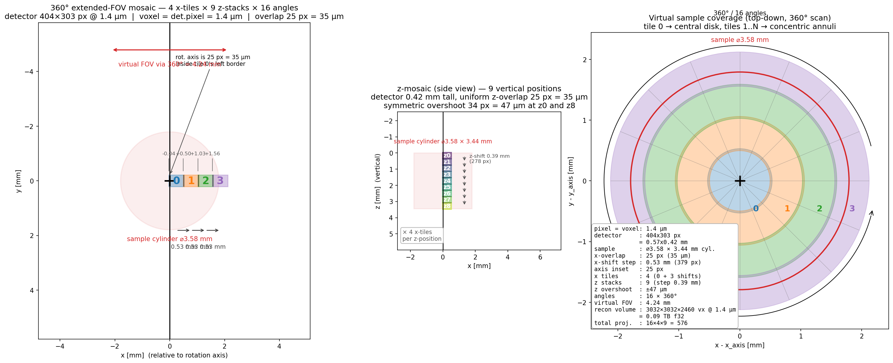
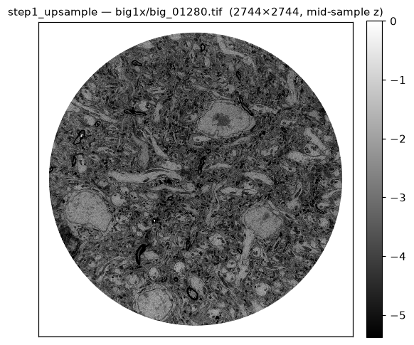
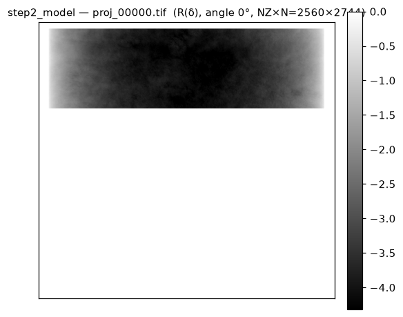
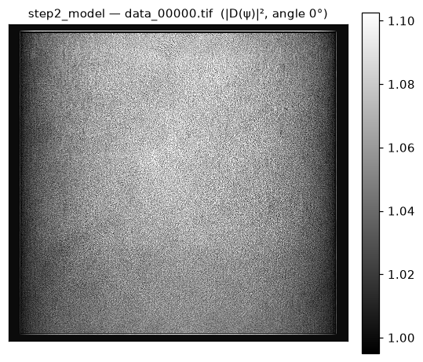
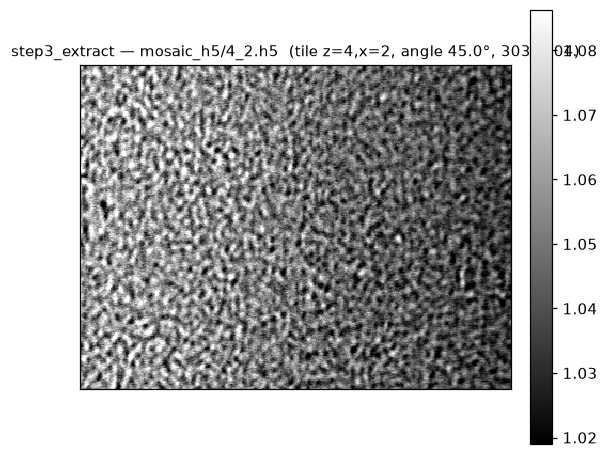

# model_mosaic

Simulate an extended-FOV **mosaic X-ray tomography scan** from a reconstructed
volume: layout the tile grid → upsample the input volume → forward-project via
USFFT Radon → propagate via Fresnel → slice the propagated data into per-tile
HDF5 files ready for downstream stitching.



*Above:* `step0_schematic.py --ups 1` — 360° extended-FOV mosaic covering a
⌀28.67 mm sample with a 4.5 × 3.4 mm detector.  4 x-tiles × 9 z-stacks × 2058
angles = 74 088 projections; virtual FOV ⌀33.96 mm.  Left = top view of tile 0
(overlapping its 180° mirror through the axis) and tile 1 (annulus).  Middle =
side view of the 9 z-stacks with uniform 280 µm overlaps.  Right = virtual
sample coverage after a full 360° rotation.  All dimensions scale with `--ups`
while the physical measurements stay constant.

Everything is **CLI-driven**, **MPI-parallel** (optional), and **GPU-accelerated**
via cupy.  All the USFFT / Fresnel machinery is vendored locally
([tomo.py](tomo.py), [tomo_large.py](tomo_large.py), [propagation.py](propagation.py),
[kernels.py](kernels.py)) — no dependency on any external `holotomocupy` install.

---

---

## Installation

Compiled dependencies: **cupy** (CUDA-capable GPU + matching toolkit),
**mpi4py** (MPI runtime), and **parallel HDF5** + `h5py-mpi` (all step
scripts write single-file h5 outputs via MPI-IO).

```bash
# Create a fresh env.
conda create -n mosaic python=3.12
conda activate mosaic

# GPU stack — pick the cupy build that matches your CUDA toolkit.
# On the APS beamline machines this is CUDA 12:
conda install -c conda-forge cupy cuda-version=12

# MPI runtime + parallel-HDF5 stack (openmpi → mpi4py → h5py-mpi all
# from conda-forge so they link against the same MPI/HDF5).
conda install -c conda-forge "openmpi>=4" mpi4py
conda install -c conda-forge "h5py=*=mpi_openmpi*" hdf5="*=mpi_openmpi*"

# Everything else.
conda install -c conda-forge tifffile matplotlib scipy numpy
```

**On Polaris (ALCF)** don't install openmpi from conda — use the site's
Cray MPICH and the `cray-hdf5-parallel` module.  A working recipe:
```bash
module load cray-hdf5-parallel
conda create -n mosaic python=3.12
conda activate mosaic
conda install -c conda-forge cupy cuda-version=12 tifffile matplotlib scipy numpy
CC=cc MPICC=cc pip install --no-cache-dir --no-binary=mpi4py mpi4py
HDF5_MPI=ON HDF5_DIR=$HDF5_DIR CC=cc pip install --no-cache-dir --no-binary=h5py h5py
```

Verify:

```bash
python -c "import cupy; print(cupy.__version__, cupy.cuda.runtime.getDeviceCount(), 'GPUs')"
mpirun -n 2 python -c "from mpi4py import MPI; print(MPI.COMM_WORLD.Get_rank())"
python -c "import h5py; print('h5py mpi=', h5py.get_config().mpi)"   # must be True
```

If `h5py mpi= False`, the step scripts fall back to single-process
opens per rank, which serialises writes — noticeably slower.  Rebuild
h5py against the MPI-enabled HDF5.

---

## Pipeline overview

```
   ┌───────────────────┐
   │  init.h5  (input) │  /exchange/data (2560, 2744, 2744) float32
   │                   │  (produced by upsample_extract.py, or dropped in)
   └────────┬──────────┘
            │
   step0_schematic.py       ─ plan tile layout, save PNG + positions.txt
            │
   step1_upsample.py        ─ init → big{UPS}x     (bilinear xy + linear z)
            │
   step2_model_big.py       ─ big{UPS}x → model_big{UPS}x
        OR                    Radon → save proj_*.tif → Fresnel → data_*.tif
   step2_model_large.py     ─ same, but host-chunked TomoLarge for UPS ≥ 8
            │
   step3_extract.py         ─ model_big{UPS}x → mosaic_h5/{z}_{x}.h5
```

Each step reads from and writes to files under a single `--path` root.
All bulk data lives in **single HDF5 files** written in parallel with
`h5py` MPI-IO — no per-slice / per-angle TIFF fan-out:

```
<path>/
  init.h5                     ← input (upsample_extract output; or drop your own)
      /exchange/data          (OUT_NZ, OUT_NYX, OUT_NYX) f32   chunks (1, OUT_NYX, OUT_NYX)
  big{UPS}x.h5                ← step1_upsample output
      /exchange/data          (OUT_NZ·UPS, OUT_NYX·UPS, OUT_NYX·UPS) f32
  model_big{UPS}x/
      proj.h5                 ← step2 Radon stage
          /exchange/data      (NTHETA, NZ, N) f32   chunks (1, NCHUNK, N)
          /exchange/theta     (NTHETA,) f32         angles in DEGREES
      data.h5                 ← step2 Fresnel stage (|D(ψ)|²)
          /exchange/data      (NTHETA, NZ, N) f32   chunks (1, DATA_CHUNK_Z, N)
          /exchange/theta     (NTHETA,) f32         angles in DEGREES
  mosaic_h5/
      0_0.h5  0_1.h5  …       ← step3 per-tile HDF5 for stitching
  mosaic_schematic{UPS}.png   ← layout figure
  mosaic_positions{UPS}.txt   ← x tile origins (px)
```

Shared filesystem (Lustre/GPFS/NFS) is assumed — `--path` should point at the
same location from every node.  Each MPI rank writes to its own disjoint
h5-chunk region (safe for independent MPI-IO), and ranks synchronise via
`MPI.Barrier` between stages.

**Lustre striping** — before the first run, set striping on the model
output directory and the big{UPS}x.h5 file to spread I/O across OSTs:

```bash
lfs setstripe -c -1 -S 4M <path>/model_big${UPS}x   # inherits by new files
lfs setstripe -c -1 -S 4M <path>/big${UPS}x.h5      # once the file exists
```

**Site-specific `--path` defaults:**

| site  | typical init location                | pass to `--path`                |
|-------|--------------------------------------|---------------------------------|
| APS   | `/data2/brain_sym_mosaic/init.h5`    | `--path /data2/brain_sym_mosaic`|
| MaxIV | `/data/ingest/vviknik/init.h5`       | `--path /data/ingest/vviknik`   |
| Polaris| `/eagle/APS_IRI/vnikitin/mosaic_brain/init.h5` | `--path /eagle/APS_IRI/vnikitin/mosaic_brain` |

---

## What each step produces

**Step 1 — upsample** writes a single `big{UPS}x.h5` (trilinear).
Mid-sample z-slice (`data[1280, :, :]` at UPS=1):



**Step 2 — model (Radon)** produces the linear Radon transform `R(δ)`
into `proj.h5` `(NTHETA, NZ, N)` with chunks `(1, NCHUNK, N)`.  Angle 0°
plane (`data[0, :, :]`):



**Step 2 — model (Fresnel)** turns `proj` into `ψ = exp(1j·(x22 + 1j·β))`,
propagates via `Propagation.D`, and writes `data.h5 = |D(ψ)|²` chunked
`(1, DATA_CHUNK_Z, N)`.  Same angle:



**Step 3 — extract** slices `data.h5` into per-tile HDF5 files using
the mosaic layout.  One tile at `(z=4, x=2)` at ~45°:



---

## GPU affinity

All GPU-using steps rely on the launcher (`set_affinity_gpu.sh`) to set
`CUDA_VISIBLE_DEVICES` per local rank, so cupy sees exactly one GPU per
process.  Do **not** call the scripts under `mpirun` without the wrapper —
otherwise every rank on a node will fight for the same device.

```bash
mpirun -n <NGPU_TOTAL> set_affinity_gpu.sh python step1_upsample.py …
```

Launcher: [set_affinity_gpu.sh](set_affinity_gpu.sh).

---

## Typical run — small scale (UPS=1 or 2, prototyping)

Use **step2_model_big.py** — GPU-only Tomo; fastest as long as
`(NCHUNK × (2N)²)` fits in GPU RAM.

```bash
cd mosaic_modeling
UPS=2
PATH_DATA=/data2/brain_sym_mosaic

# 0. Plan the mosaic (produces mosaic_schematic{UPS}.png + positions txt)
python step0_schematic.py --ups $UPS --path $PATH_DATA

# 1. Upsample init.h5 into big{UPS}x.h5
mpirun -n 4 set_affinity_gpu.sh \
    python step1_upsample.py --ups $UPS --path $PATH_DATA

# 2. Radon + Fresnel → model_big{UPS}x/proj.h5 and data.h5
mpirun -n 4 set_affinity_gpu.sh \
    python step2_model_big.py --ups $UPS --path $PATH_DATA \
                              --nchunk 32 --nprop-batch 8

# 3. Slice data.h5 into per-tile HDF5 files (MPI-parallel; -n = tiles/rank)
mpirun -n 4 python step3_extract.py --ups $UPS --path $PATH_DATA
```

---

## Full-scale run — UPS ≥ 8

Use **step2_model_large.py**.  At `UPS=8`, `N=21952`, and a full
`Tomo._buf_fde` would be `NCHUNK · (2N)² · 8 B ≈ 15 GB · NCHUNK` — the
GPU-only Tomo doesn't fit.  `TomoLarge` keeps the big padded frequency-domain
buffer on the **host** and streams small chunks through the GPU, so peak GPU
memory scales with the chunk sizes rather than with `(2N)²`.

Chunk sizes must divide the sizes they slice into:
- `--chunk-n`     divides `N` and `2N`
- `--chunk-theta` divides `NTHETA` (= `3·N/4` by default)
- `--chunk-xy`    divides `2N`

Defaults (686 / 343 / 686) are divisors of `2744` and `2058`, so they work
for **any** integer `--ups ≥ 1`.

```bash
UPS=8
PATH_DATA=/data2/brain_sym_mosaic

python step0_schematic.py --ups $UPS --path $PATH_DATA

mpirun -n 8 set_affinity_gpu.sh \
    python step1_upsample.py --ups $UPS --path $PATH_DATA

# Multi-node example: 4 nodes × 4 GPUs each = 16 ranks.
# TomoLarge peak host memory per R call:
#   fde  ≈ NCHUNK · (2N)² · 8 B  ≈ NCHUNK · 15 GB
#   sino ≈ NCHUNK · THETA_BATCH · N · 8 B
# so at NCHUNK=1 and THETA_BATCH=NTHETA that's ~15 + 2.5 + 2.5 = 20 GB/rank.
mpirun -n 16 --map-by ppr:4:node set_affinity_gpu.sh \
    python step2_model_large.py --ups $UPS --path $PATH_DATA \
                                --nchunk 1 --nprop-batch 1 \
                                --chunk-n 686 --chunk-theta 343 --chunk-xy 686

# step3 is CPU-only but MPI-shards tiles across ranks — worth running on
# many ranks when tile count × NTHETA is large.
mpirun -n 16 python step3_extract.py --ups $UPS --path $PATH_DATA
```

**On Polaris** replace `mpirun` with `mpiexec --ppn 4 --depth=8 --cpu-bind depth`
and use `set_affinity_gpu_polaris.sh` (which reads `PMI_LOCAL_RANK` and
reverse-maps GPU indices for NUMA locality):

```bash
mpiexec -n 16 --ppn 4 --depth=8 --cpu-bind depth \
    ./set_affinity_gpu_polaris.sh \
    python step2_model_large.py --ups $UPS --path $PATH_DATA
```

---

## Choosing between step2_model_big vs step2_model_large

|                 | `step2_model_big.py`               | `step2_model_large.py`                     |
|-----------------|------------------------------------|--------------------------------------------|
| Tomo backend    | GPU-only (`Tomo`)                  | Host-chunked (`TomoLarge`)                 |
| Peak GPU memory | `NCHUNK · (2N)² · 8 B`             | `~CHUNK_N²` (much smaller)                 |
| Peak host memory| small (chunk read + result strip)  | `NCHUNK · (2N)² · 8 B` (moved to host)     |
| Best for        | `UPS ≤ 4` on a 40 GB GPU           | `UPS ≥ 8`, or any `N` too big for the GPU  |
| Extra CLI       | —                                  | `--chunk-n`, `--chunk-theta`, `--chunk-xy` |

Same pipeline, same output filenames and layout — the two are drop-in
substitutes at step 2.  Pick `_large` any time step2_model_big.py OOMs on the GPU
or produces `_buf_fde` estimates that exceed device memory.

---

## Per-stage CLI reference (most-used flags)

Full options: `python step<N>_<name>.py --help`.

### step0_schematic.py
| flag | default | notes |
|------|---------|-------|
| `--ups`  | `1` | drives detector/sample/pixel scaling |
| `--path` | `/data2/brain_sym_mosaic` | where the PNG + `mosaic_positions{UPS}.txt` land |

### step1_upsample.py
| flag | default | notes |
|------|---------|-------|
| `--ups`     | `4` | upsample factor in every axis |
| `--path`    | `/data2/brain_sym_mosaic` | reads `{path}/init`, writes `{path}/big{UPS}x` |
| `--n-write` | `8` | parallel SSD writers per rank |
| `--n-read`  | `2` | background input prefetchers per rank |

### step2_model_big.py / step2_model_large.py
| flag | default | notes |
|------|---------|-------|
| `--ups`     | `2` / `8` | matches step1_upsample `--ups` |
| `--path`    | `/data2/brain_sym_mosaic` | reads `big{UPS}x`, writes `model_big{UPS}x` |
| `--ntheta`  | `3·N/4` | override for cheaper prototyping (e.g. `--ntheta 128`) |
| `--stage`   | `both`  | `radon` \| `prop` \| `both` — skip stages if resuming |
| `--nchunk`  | `8` / `1` | z-slices per Radon call (memory ↔ speed) |
| `--nprop-batch` | `8` / `1` | angles per Fresnel batch |
| `--n-load-threads` | `8` | threaded I/O (read *and* scatter-write) |
| `--beta-ratio` | `100` | weak-absorption ratio; β = phase/BETA_RATIO |
| `--phase-scale` | `1.0` | amplify phase to make Fresnel fringes visible |
| `--distance` | `1.0 m` | sample→detector distance (parallel beam) |
| `--voxelsize` | `1.4 µm` | voxel = detector pixel |
| `--chunk-{n,theta,xy}` | `686/343/686` | *large only* — must divide `N`/`NTHETA`/`2N` |

### step3_extract.py
| flag | default | notes |
|------|---------|-------|
| `--ups`   | `2` | matches step2_model `--ups` |
| `--path`  | `/data2/brain_sym_mosaic` | reads `model_big{UPS}x`, writes `mosaic_h5` |
| `--z-pad` | `50` | matches upsample_extract's `--z-pad` |
| `--air-fill` | `1.0` | OOB tile pixels (air transmission intensity) |

---

## Resuming / partial runs

- **Only Radon** (skip Fresnel): `step2_model_*.py --stage radon`
- **Only Fresnel** (`proj.h5` already on disk): `step2_model_*.py --stage prop`
- **Change UPS mid-experiment**: everything is UPS-tagged (`big{UPS}x.h5`, `model_big{UPS}x/`, `mosaic_schematic{UPS}.png`, `mosaic_positions{UPS}.txt`), so runs at different UPS values coexist under the same `--path` without collision.

---

## Preparing `init.h5`

If you don't already have an `init.h5`, [upsample_extract.py](upsample_extract.py)
crops + masks + soft-tapers a 3-D multi-page TIFF from a reconstruction and
writes the result as `{path}/init.h5`:

```bash
mpirun -n 4 python upsample_extract.py \
    --src /local/tomodata3/vnikitin/…/rec_obj_real/0096.tiff \
    --path /data2/brain_sym_mosaic
```

Optional (not part of the numbered pipeline).  If you already have a proper
`init.h5` with `/exchange/data` of shape `(OUT_NZ, OUT_NYX, OUT_NYX)`
float32, skip it.
